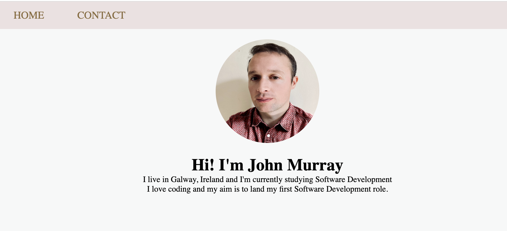

# John Murray - Personal Website
A simple personal website using HTML and CSS

View it [here](https://jmurrii.github.io/personal_website/)

## Summary
As the introductory exercise of Andy Sterkowitz' Software Development Mastermind Program, I was given the task of creating a personal website.
The languages I used were HTML and CSS.
I learned how to create a functional navigation bar, and how to centre images and text on a page.
I also learned how to add a little hover effect on the navbar.
I learned how to do that with [this youtube tutorial](https://www.youtube.com/watch?v=FEmysQARWFU)

## Author
John Murray - _Software Developer_
